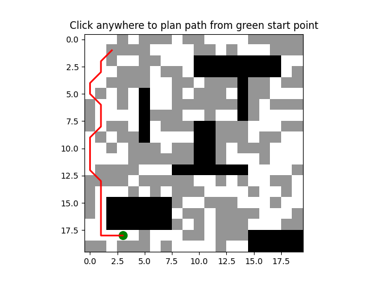

# robotics_pathplanning

Simple A* path-planning demo with interactive visualization using Matplotlib.

Overview

This repository contains a minimal A* implementation (`A_star.py`) and a Dijkstra reference (`Djikstra.py`). `A_star.py` builds a 2D grid with obstacles and a secondary "ash" terrain (value 0.5). Click the plot to set a goal; the script plans a path from the current green start marker to the clicked goal and draws the path in red.

Example



Key points

- Grid values: `0` = free, `0.5` = ash (higher-cost terrain), `1` = obstacle
- Movement: 8-connectivity (cardinal cost = 1, diagonal cost = √2)
- Diagonal corner cutting prevented by checking adjacent cells when moving diagonally
- Ash regions which represent rough terrains increase the A* heuristic by 25% when the current node is in ash, biasing the planner to avoid ash where possible

Requirements

See `requirements.txt` for pinned dependencies. At minimum this project requires:

- Python 3.8+
- numpy
- matplotlib

Install

Install dependencies with pip:

```
pip install -r requirements.txt
```

Run

From the repository root run:

```
python A_star.py
```

Controls / Interaction

- Click anywhere on the plotted grid to set the goal. The algorithm will plan from the current start to the clicked cell.
- The green marker is the current start; it is updated to the goal after a successful plan.

Customization

- Change the map size and obstacles by editing the top of `A_star.py` (grid_size, obstacle slices, `start`).
- The ash region generation is randomized but seeded with `np.random.seed(42)` for reproducibility; change or remove the seed to vary ash layout.
- To change how ash affects planning, see the `heuristic` function in `A_star.py`.

Notes

- Traversable cells include both `0` and `0.5` (ash), but obstacles (`1`) are none traversable.
- The code currently treats the robot as a point; steering costs and kinematic constraints are not modeled.

